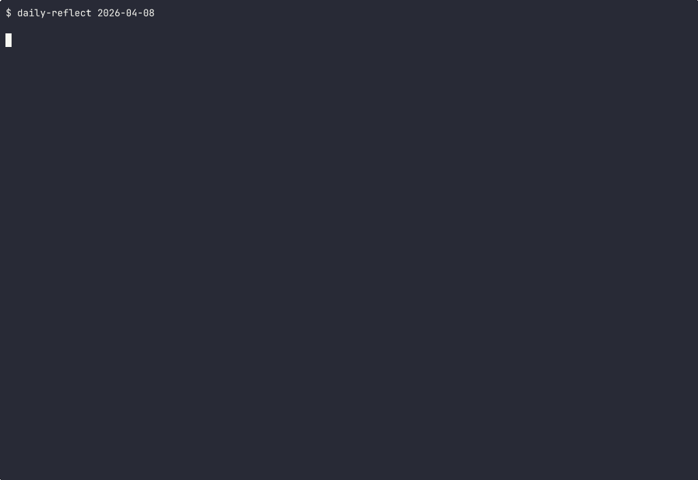

# Daily Reflection System

Reconstructs how you spent your day from lifelog screenshots using a local VLM. No cloud, no telemetry — your data stays on your machine.

Classifies screenshots into 12 activity categories, builds an activity timeline, pulls Google Calendar events, and populates your Obsidian daily note automatically.



## Quick Start

```bash
# Clone and enter
git clone https://github.com/MattHandzel/daily-reflection-system
cd daily-reflection-system

# Process yesterday (default)
./daily-reflect

# Process a specific date
./daily-reflect 2026-04-08

# Process today so far
./daily-reflect --today

# Generate reflection file without modifying daily note
./daily-reflect 2026-04-08 --no-inject
```

## How It Works

```
Screenshots (10s intervals) → Dedup (dHash) → Sample (5min) → VLM Classify → Timeline → Daily Note
```

1. Collects screenshots for the target date (04:00 to 04:00 boundary)
2. Deduplicates near-identical frames using perceptual hashing (dHash)
3. Samples at 5-minute intervals (~96 frames from ~3000 screenshots)
4. Enriches with window manager context (title, class) for disambiguation
5. Classifies each frame via local Ollama VLM into 12 activity categories
6. Merges per-frame classifications into time blocks (min 2-minute duration)
7. Pulls Google Calendar events into daily note's "Time Plan" table
8. Populates daily note's "Time Log (actual)" with reconstructed timeline
9. Generates standalone reflection file with category summary + deep work tracking

## Output

**Daily note** — Time Plan (calendar) + Time Log (VLM reconstruction):

```markdown
### Time Log (actual)
| Time  | Activity                          | Duration | Notes            |
| ----- | --------------------------------- | -------- | ---------------- |
| 04:00 | AI Interaction: Claude conversation | 10m    | high confidence  |
| 04:10 | Deep Work: Coding: tmux session     | 5m     | high confidence  |
| 14:53 | Meetings: Cal.com Video call        | 5m     | high confidence  |
```

**Reflection file** — Full detail with category breakdown:

```markdown
## Category Summary
| Category           | Time  |
| Deep Work: Writing | 3.7h  |
| AI Interaction     | 1.8h  |
| Deep Work: Coding  | 30m   |

## Deep Work
- Total deep work: 4.5h
- Target: 4.0h
- Status: MET (4.5/4.0h)
```

## Categories

| Category | What it captures |
|----------|-----------------|
| `deep_work_coding` | Terminal, IDE, code editors |
| `deep_work_writing` | Documents, notes, prose |
| `deep_work_research` | Reading papers, documentation |
| `communication_messaging` | Chat apps (Slack, Discord, etc.) |
| `communication_email` | Email clients, webmail |
| `meetings` | Video calls, meeting apps |
| `planning_admin` | Calendar, task management |
| `learning` | Educational content, courses |
| `social_media_browsing` | Social media, Reddit, aimless browsing |
| `entertainment` | YouTube entertainment, games |
| `ai_interaction` | Claude, ChatGPT, LLM conversations |
| `break_afk` | Lock screen, screensaver, idle |

## Requirements

- **Nix** (dependencies managed via `shell.nix` — no pip needed)
- **Lifelog screenshots** at `~/lifelog/data/screen/` (ISO-timestamp PNGs + thumbnails)
- **Ollama** with a vision model (default: `gemma3:4b-it-qat`)
- **Hyprland window log** (optional) at `~/lifelog/data/index.db` for disambiguation
- **Google Calendar** OAuth credentials (optional) for Time Plan population

## Configuration

All paths are configurable via environment variables:

| Variable | Default | Description |
|----------|---------|-------------|
| `DAILY_REFLECT_SCREEN_DIR` | `~/lifelog/data/screen` | Screenshot directory |
| `DAILY_REFLECT_DB` | `~/lifelog/data/index.db` | Hyprland window log SQLite DB |
| `DAILY_REFLECT_DAILIES_DIR` | `~/Obsidian/Main/dailies` | Obsidian daily notes directory |
| `DAILY_REFLECT_REFLECTIONS_DIR` | `~/Obsidian/Main/.../reflections` | Reflection output directory |
| `DAILY_REFLECT_OLLAMA_URL` | `http://localhost:11434/api/generate` | Ollama API endpoint |
| `DAILY_REFLECT_MODEL` | `gemma3:4b-it-qat` | Ollama vision model |
| `DAILY_REFLECT_GCAL_CREDENTIALS` | `~/secrets/gcal_client_secret.json` | Google Calendar OAuth client |
| `DAILY_REFLECT_GCAL_TOKEN` | `~/Projects/.../token.json` | Google Calendar OAuth token |
| `DAILY_REFLECT_CACHE_DIR` | `./cache` | Classification cache directory |

## Performance

| Metric | Value |
|--------|-------|
| Screenshots/day | ~3,000 (captured every 10s) |
| After dedup | ~1,100 unique frames |
| After sampling | ~96 frames (5-min intervals) |
| First run | ~5 minutes (VLM inference) |
| Cached re-run | ~17 seconds |
| VLM speed | ~3s per image (RTX 3060, gemma3:4b) |

Classification results are cached to `cache/{date}.json`. Re-runs skip already-classified frames.

## Architecture

```
daily_reflect/
  config.py      — Environment-based configuration
  collector.py   — Screenshot collection + Hyprland window data
  dedup.py       — Perceptual hash dedup + temporal sampling
  classifier.py  — Ollama VLM classification with structured output
  timeline.py    — Merge per-frame classifications into time blocks
  calendar.py    — Google Calendar event fetching
  reporter.py    — Markdown generation + daily note injection
  main.py        — CLI entry point
```

## License

MIT
